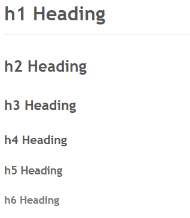

# T05 :: Headers

> **Headerlines from Level h1 to h6** must be visible and be rendered with target CSS-styles

# h1 Heading
## h2 Heading
### h3 Heading
#### h4 Heading
##### h5 Heading
###### h6 Heading

## Expected Result:

> 
